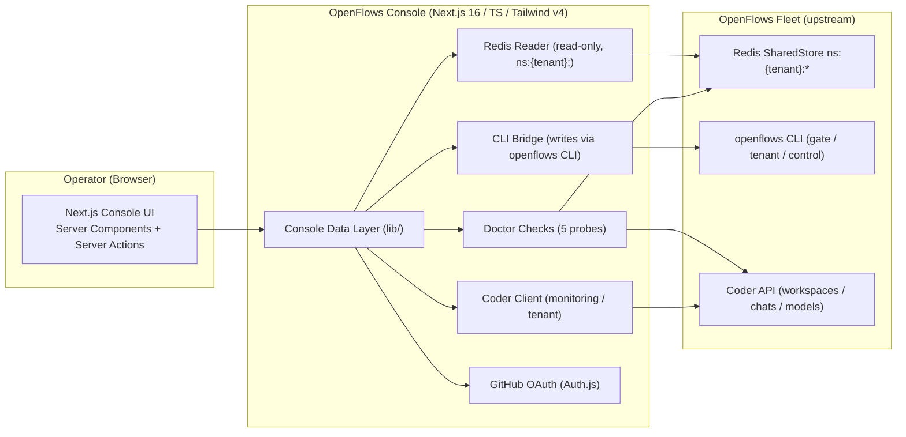

# OpenFlows Console — System Architecture

**Status:** Foundation (draft — informs the work tracked by [openflows#216](https://github.com/The-AgenticFlow/openflows/issues/216))
**Scope:** The OpenFlows Console web UI (`The-AgenticFlow/openflows-console`) and how it observes and operates the OpenFlows fleet.

---

## 1. Purpose

OpenFlows Console is the operator's visual control surface for [OpenFlows](https://github.com/The-AgenticFlow/openflows): an autonomous AI software team that turns GitHub issues into reviewed, production-ready pull requests running on self-hosted [Coder](https://coder.com) workspaces.

Today, operating OpenFlows is entirely CLI/terminal-based (`openflows run|bootstrap|tenant|status|doctor|gate|store`). The Console gives operators a hygienic, non-saturated web UI to:

- **Monitor agent activities on Coder** — live agent lifecycle and work progress at a glance.
- **Manage tenants** — add/delete multi-tenant workspaces together with their resources.
- **Track tasks on a Kanban board** — through *implementation → progress → review → done → merge*.
- **Manage system health** — surface what `openflows doctor` reports, without reading terminal output.

It is the **foundation layer** that all further OpenFlows operations and supervision work builds on.

## 2. Ground truth (what we are building against)

Three parallel study passes against the OpenFlows Rust repo established the facts below. All paths are relative to `openflows/`.

### 2.1 The console is greenfield

The OpenFlows architecture docs describe a web UI / control panel / `openflows-dashboard` binary / `openflows control` CLI / control-plane-defined registry — but **none of this exists in code**. The shipped `openflows` binary exposes only: `run`, `bootstrap`, `tenant`, `status`, `doctor`, `gate`, `hooks`, `reset-orchestration`, `store` (`binary/src/bin/agentflow.rs:27-70`). There is no HTTP server, no `control` subcommand, no `set-registry`, and no `openflows-dashboard` binary (`binary/Cargo.toml:15-21`).

> Consequence: the Console is the **first implementation** of the documented web surface. Where the docs describe a schema that does not exist yet (control state, live registry write path), the Console defines the de facto contract, guided by the documented intent.

### 2.2 North-star constraints (from `docs/architecture/openflows-system-architecture.md`)

- §3.5: the web UI is a thin client over the same control-plane state/commands the CLI uses; it **never talks to Redis directly** — *"the Controller/harness remain the only Redis writers."*
- §3.4 / §3.5: **every web action maps 1:1 to a CLI command**, so the CLI and UI can never drift.
- §3.6: the **live `registry_json` store key is the single source of truth** for the agent fleet; updates apply on the next poll pass, **no restart**.
- §3.7: a `control` state (`paused | drained | targeted | auto`) with a `targets` set (repo/issue/label) and a per-run `dispatch_budget`.

### 2.3 Read model (fully implemented — safe to consume)

The Console dashboard/Kanban reads durable, tenant-namespaced Redis keys (`ns:{tenant}:{key}`):

| Logical key | Type | Purpose |
| --- | --- | --- |
| `tickets` | `Vec<Ticket>` | ingested GitHub issues + `TicketStatus` |
| `worker_slots` | `HashMap<String, WorkerSlot>` | per-role/slot availability + workspace id |
| `ticket:{id}:status` | `{phase, role, ts}` | fine-grained phase machine |
| `ticket:{id}:gate:{phase}` | `GateApproval` | single-use gate token |
| `ticket:{id}:review:{role}` | `ReviewPayload` | SENTINEL verdict |
| `ticket:{id}:deployment` | `MergePayload` | VESSEL merge result |
| `ticket:{id}:pr` | `PrInfo` | opened PR info |
| `ticket:{id}:handoff` | `HandoffPayload` | FORGE→SENTINEL contract |
| `pending_prs` | `Vec<Value>` | PRs awaiting VESSEL / CI lane |
| `ci_readiness` | `CiReadiness` | CI workflow presence |
| `heartbeat:{role}-T-{ticket}` | `HeartbeatRecord` | liveness (stale after 90s, TTL 120s) |
| `registry_json` | `String` | (planned) live fleet registry |

Two parallel status models must be **reconciled** in the UI:

- `Ticket.status` — terminal/escalation enum: `open | assigned | in_progress | merged | failed | completed | exhausted | awaiting_human`.
- `ticket:{id}:status.phase` — workflow phase: `planning | building | testing | review_ready | blocked`.

`openflows status` today only surfaces `tickets`, `worker_slots`, `pending_prs`; the Console reads richer keys directly for the dashboard.

### 2.4 Doctor health checks (to surface in the UI)

`binary/src/doctor.rs` performs exactly five checks:

| Check | Probe | Hard fail? |
| --- | --- | --- |
| Coder reachable | `GET {CODER_URL}/api/v2/buildinfo` | yes |
| Coder image tag | env read + semver comparison | no (warn on drift) |
| LLM models configured | `GET /api/v2/organizations` → `GET /api/v2/organizations/{org}/chats/models` | no (warn) |
| GitHub external auth | env presence of `CODER_EXTERNAL_AUTH_0_*` trio | no (warn) |
| Redis reachable | `SharedStore::new_redis(REDIS_URL)` | yes |

### 2.5 Coder API surface (for monitoring + tenant ops)

`crates/coder-client/src/lib.rs` — key endpoints: `/api/v2/buildinfo`, `/api/v2/users`, `/api/v2/users/me`, `/api/v2/organizations`, `/api/v2/users/{id}/keys/tokens`, `/api/v2/templates`, `/api/v2/users/{user_id}/workspaces` (POST), `/api/v2/workspaces{/{id}}` (GET/start/stop/DELETE), `/api/v2/chats` (POST/GET/PATCH/interrupt), `/api/v2/organizations/{org}/chats/models`. Chats carry `ticket_id`/`role`/`flow`/`tenant` labels. **No REST exec** — in-workspace commands run via `coder ssh`.

### 2.6 Tenant lifecycle

- A tenant "exists" iff its `ns:{tenant}:*` keys exist in Redis (enumerated via `raw_keys("ns:*")`).
- **Add**: create tenant-owner Coder user + GitHub OAuth link + `openflows-nexus` workspace (params: `repo_url, redis_url, coder_url, coder_session_token, tenant, github_repository, github_pat, coder_chat_hook_secret, coder_chat_hook_url, start_controller=true`) → persist `repository` key.
- **Clean**: reset `awaiting_human`/`failed` tickets → `open`, clear recovery counters + `worker_slots`.
- **Remove**: purge Redis keyspace; **Coder workspaces/chats require manual cleanup** (a known gap the Console can close).

---

## 3. High-level architecture



```text
                 ┌──────────────────────────────────────────────────┐
   Operator ───▶ │                 OPENFLOWS CONSOLE                │
   (browser)     │             Next.js (App Router, TS)             │
                 │                                                  │
                 │  ┌────────────────────────────────────────────┐  │
                 │  │  Server Components + Server Actions         │  │
                 │  │  (the trusted backend, no direct Redis from │  │
                 │  │   the browser)                              │  │
                 │  └───────────────┬────────────────────────────┘  │
                 │                  │                               │
                 │      ┌───────────┴───────────┐                   │
                 │      │  Console data layer   │                   │
                 │      │  · Redis reader (read)│                   │
                 │      │  · CLI bridge (write) │                   │
                 │      │  · Doctor checks      │                   │
                 │      │  · Coder client       │                   │
                 │      └───────────┬───────────┘                   │
                 └──────────────────┼───────────────────────────────┘
                                    │
            ┌───────────────────────┼───────────────────────────────┐
            ▼                       ▼                               ▼
     Redis (SharedStore)      openflows CLI            Coder API
     ns:{tenant}:*            (writes, parity)         monitoring/tenant
     (READ for viz)           (gate/control/           (workspaces, chats,
                              set-registry/            users, models)
                              tenant ops)
```

### 3.1 The core decision (see ADR-0001)

The Console is **read-mostly over Redis and write-via-CLI**:

- **Read path** — the server-side data layer reads durable Redis keys (via a typed reader that mirrors `ns:{tenant}:` prefixing) to render the dashboard, Kanban, health, and tenant list. Reading does not violate the "only writers are the Controller/harness" rule.
- **Write path** — mutations (gate approve, tenant add/remove, control pause/target, `set-registry`, escalation recovery) go through the same primitives the CLI uses. Until the Controller exposes an HTTP API, the data layer invokes the `openflows` CLI (subprocess), preserving the documented **CLI↔UI parity** rule.
- **Doctor** — re-implemented as typed checks server-side (same probes as `binary/src/doctor.rs`), aggregated into a health surface.
- **Coder ops** — tenant workspace/monitoring calls through a Coder API client mirroring `crates/coder-client`.

This delivers the foundation today with zero Rust changes, and leaves a clean seam to swap the write path to a future Controller HTTP API (ADR-0001, "future" note).

### 3.2 Building on releases (see ADR-0005)

Upstream OpenFlows is actively released. The Console therefore:

- pins/supports specific OpenFlows releases (compatibility matrix),
- reads Redis with **tolerant, defensive schemas** (`#[serde(default)]`, unknown-field-safe) so an upstream field addition never breaks the UI,
- treats the CLI as the write contract, and
- isolates all upstream coupling in the `lib/` data layer so version bumps touch one place.

## 4. UI surfaces (foundation scope)

1. **Onboarding / Auth** — GitHub OAuth sign-in to the Console; free-trial; add `repo/owner` per tenant. *(Console-level auth is separate from Coder's GitHub external auth.)*
2. **Dashboard (health + fleet)** — `doctor` checks as a status panel; live tickets, worker slots, heartbeats, PRs, `awaiting_human` escalations.
3. **Tenant management** — add / list / clean / remove tenants.
4. **Task Kanban** — tickets across *implementation → progress → review → done → merge*, reconciled from `Ticket.status` + phase.
5. **Detail views** — per-ticket: gate, review, PR, handoff, deployment, escalation.

Design language: hygienic, friendly, non-saturated; dense information with clear hierarchy, no visual clutter.

## 5. Out of scope for the foundation (later milestones)

- Agent registry editor (live `set-registry` UI) — requires the (unimplemented) control-plane registry contract.
- Halt / target / continue fleet controls — requires the (unimplemented) `control` state.
- Programmatic GitHub-OAuth-grant verification (today it's a manual Enter-key wait in `ensure_tenant`).
- Automated Coder cleanup on tenant remove.

These are documented decisions in the OpenFlows architecture; the Console defers them to keep the foundation shippable.

## 6. Related docs

- `docs/adr/0001-console-backend-and-write-path.md` — read-over-Redis / write-via-CLI (the crux).
- `docs/adr/0002-nextjs-app-router-and-data-layer.md` — framework + data-layer structure.
- `docs/adr/0003-github-oauth-auth-model.md` — Console auth & onboarding.
- `docs/adr/0004-kanban-data-reconciliation.md` — reconciling the two status models.
- `docs/adr/0005-upstream-release-coupling.md` — building on OpenFlows releases with defensive reads and a compatibility matrix.
- OpenFlows: `docs/architecture/openflows-system-architecture.md` (§3.4–3.7), `binary/src/doctor.rs`, `crates/config/src/state.rs`, `crates/pocketflow-core/src/store.rs`.
